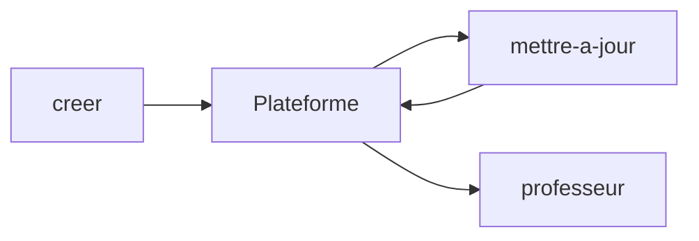

# apprentissage

Plugin Claude Code qui crée et fait vivre des **plateformes d'apprentissage** personnelles,
sur n'importe quel sujet. Distribué par le hub [atelier](https://github.com/Soria54/Atelier).

Construit à partir de mes deux parcours ([parcours-ia](https://github.com/Soria54/parcours-ia),
[parcours-big-data](https://github.com/Soria54/parcours-big-data)). Le design vient du
plugin [design](https://github.com/Soria54/agent-design) (style **Contraste Fin**).

## Les 3 commandes

| Commande | Rôle |
|---|---|
| `/apprentissage:creer <sujet>` | Crée une plateforme de zéro : plan validé, application, cours, dictionnaire, exercices |
| `/apprentissage:mettre-a-jour <demande>` | Ajoute ou complète du contenu, réécrit un cours, lance la veille, met l'application à niveau ou migre un ancien parcours |
| `/apprentissage:professeur <sujet>` | Spécialise la session : un professeur du domaine, qui explique court, en listes, avec schémas |



## Installation

```
/plugin marketplace add Soria54/atelier
/plugin install apprentissage@atelier
```

Le plugin `design` est une **dépendance** : il s'installe avec.

## Style des explications

Pour un apprenant **dyslexique** : court mais ouvert, des listes plutôt que des
paragraphes, un schéma dès qu'il y a une relation, le point important mis en évidence.
Règles complètes : [pedagogie/STYLE.md](pedagogie/STYLE.md).

## Ce que contient une plateforme

- `app/` : application React (modèle `design` + pages de la plateforme)
  - Accueil : avancement, étape à reprendre, nouveautés de la veille
  - Parcours : cours avec schémas Mermaid, notions, exercices, ressources, questions
  - Dictionnaire, Bonnes pratiques, Objectif (compétences)
  - Option **Lecture confortable** (texte plus grand et plus espacé)
- `donnees/` : JSON source de vérité, Markdown générés
- `NN-etape/cours.md` et `exercices/` ; `veille/` ; Docker et hébergement

## Organisation du dépôt

| Chemin | Rôle |
|---|---|
| `skills/` | Les 3 commandes |
| `agents/redacteur.md` | Sous-agent qui rédige le cours et les énoncés d'une étape |
| `pedagogie/STYLE.md` | Règles de rédaction |
| `modele/app/` | Fichiers ajoutés par-dessus le modèle du plugin `design` |
| `modele/racine/` | Racine d'une plateforme : données vides, veille, Docker, CI… |
| `scripts/creer-plateforme.mjs` | Crée une plateforme vide |
| `scripts/mettre-a-niveau.mjs` | Remplace `app/` par la dernière version, garde le contenu |
