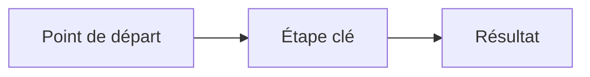

# Cours · Étape NN · Titre

## En une phrase

==L'idée principale de l'étape, en une phrase.==

## Pourquoi c'est utile

- Une raison concrète.
- Une situation où je m'en sers.

## Le schéma

## L'essentiel

### Première notion

- Une idée par puce.
- **Le mot clé** en gras.

> [!IMPORTANT]
> Ce qu'il faut retenir de cette notion.

### Deuxième notion

| Ce que je vois | Ce que ça veut dire |
|---|---|
| … | … |

## Exemple

Un exemple court et réel, avant toute règle générale.

## Pièges

- **Piège** : explication en une ligne.

## À retenir

1. Point clé 1.
2. Point clé 2.
3. Point clé 3.

## Pour aller plus loin

- Une question ouverte à explorer.
- Un lien vers l'étape suivante.
