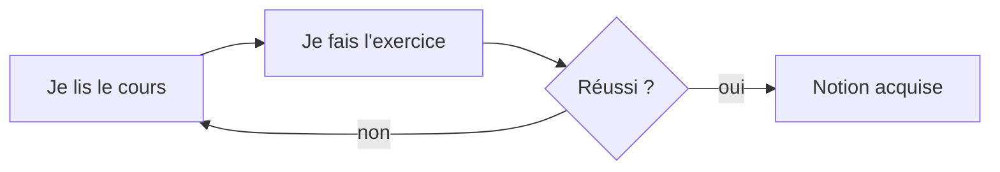

# Style des explications

Règles suivies par les 3 commandes du plugin, par le sous-agent `redacteur` et par les
plateformes créées (copie dans `_modeles/style.md`).

Elles viennent du profil de l'utilisateur :
- il est **dyslexique** ;
- il préfère des **explications courtes mais ouvertes** ;
- il préfère des **listes** aux paragraphes ;
- il veut des **schémas** ;
- il veut que les **points importants soient mis en évidence**.

## Les 8 règles

1. **Court.**
   - Une idée par phrase. 15 mots environ, 20 au maximum.
   - Un paragraphe = 3 lignes au maximum. Au-delà, faire une liste.
2. **En listes.**
   - Puces pour les idées, numéros pour les étapes à suivre dans l'ordre.
   - 7 puces au maximum par liste. Au-delà, regrouper sous des sous-titres.
   - Un seul niveau de sous-puces.
3. **Un schéma dès qu'il y a une relation.**
   - Processus, cycle, cause → effet, architecture, comparaison, hiérarchie.
   - Au moins **un schéma par cours**, en tête de la partie « L'essentiel ».
4. **Mettre en évidence, avec parcimonie.**
   - `==texte==` : le point **le plus** important d'une section (surligné dans
     l'application). Une fois par section au maximum.
   - `**gras**` : les mots clés. 2 ou 3 par section au maximum.
   - `> [!IMPORTANT]` : l'encadré « À retenir ». Un ou deux par cours.
   - Si tout est mis en évidence, plus rien ne ressort.
5. **Ouvert.**
   - Terminer par 2 ou 3 pistes : une question, un lien avec la suite, une idée à
     tester.
   - Ne pas tout dire : donner l'essentiel, puis dire où creuser.
6. **Concret d'abord.**
   - Un exemple réel **avant** la règle générale.
   - Une analogie avec la vie courante si la notion est abstraite.
7. **Mots simples.**
   - Définir chaque terme technique à sa première apparition, en une ligne.
   - Développer chaque sigle entre parenthèses la première fois : « API (interface de
     programmation) ».
   - Pas de double négation, pas de phrase passive quand l'active marche.
8. **En français.**
   - Toujours, même si la question, le code ou la source sont en anglais.
   - Un terme technique anglais reste en anglais s'il est d'usage (« commit », « API »),
     avec sa traduction ou sa définition à la première apparition.
   - Une source en anglais se résume en français ; indiquer « (en anglais) » à côté du lien.

## Ce qu'il faut éviter

- Les murs de texte.
- Les phrases à rallonge avec plusieurs virgules.
- L'italique pour de longs passages (difficile à lire). Le réserver à un mot.
- Les MAJUSCULES pour insister (utiliser `==…==` ou `**…**`).
- Les tableaux de plus de 4 colonnes (illisibles sur téléphone).
- Les mots proches qui se confondent dans un même passage (« acquis / requis »,
  « effectif / efficace ») : en choisir un et le garder.

## Les schémas

### Dans un fichier (cours, énoncé, README)

Utiliser **Mermaid** dans un bloc de code ` ```mermaid ` :
- l'application le dessine en noir et blanc, traits fins ;
- GitHub l'affiche aussi.

Règles :
- 3 à 8 boîtes. Au-delà, faire deux schémas.
- Libellés de 1 à 4 mots.
- Sens de lecture : de gauche à droite (`flowchart LR`) ou de haut en bas (`TD`).
- **Un seul** nœud marqué `:::important` par schéma : il prend la couleur de mise en
  évidence.
- Pas de couleur dans le code du schéma (`style`, `classDef … fill:`) : le thème s'en
  charge.

Types utiles :

| Besoin | Mermaid |
|---|---|
| Processus, étapes, causes | `flowchart LR` |
| Échanges entre acteurs | `sequenceDiagram` |
| États et transitions | `stateDiagram-v2` |
| Idées autour d'un thème | `mindmap` |
| Chronologie | `timeline` |

Exemple :



### Dans la conversation (terminal, VS Code)

Mermaid ne s'affiche pas toujours dans la conversation. Utiliser un **schéma en texte**
dans un bloc de code :

```
 Requête ──▶ API ──▶ Base de données
              │
              └──▶ Journal
```

- Flèches `──▶`, branches `├──` `└──`, boîtes `┌─┐ └─┘` si besoin.
- 60 caractères de large au maximum.
- Proposer la version Mermaid si l'utilisateur veut garder le schéma dans un fichier.

## Forme d'une réponse en conversation

```
**En bref** : la réponse en une phrase.

<schéma si utile>

- Point 1
- Point 2
- Point 3

**À retenir** : ==le point clé==.

Pour aller plus loin :
- une question ouverte
- une piste à explorer
```

- 15 lignes environ. Plus long seulement si l'utilisateur le demande.
- Si la question est vaste : répondre à l'essentiel, puis proposer de détailler une
  partie (« Je détaille le point 2 ? »).

## Forme d'un cours (`NN-etape/cours.md`)

Modèle : `_modeles/cours.md` de la plateforme. Sections dans cet ordre :

1. **En une phrase** : l'idée de l'étape, surlignée.
2. **Pourquoi c'est utile** : 2 ou 3 puces concrètes.
3. **Le schéma** : la vue d'ensemble.
4. **L'essentiel** : une sous-partie par notion, chacune courte, avec listes, tableau ou
   schéma.
5. **Exemple** : un cas réel, court.
6. **Pièges** : les erreurs fréquentes, une ligne chacune.
7. **À retenir** : 3 à 5 points numérotés.
8. **Pour aller plus loin** : 2 ou 3 pistes ouvertes.

Longueur : 80 à 200 lignes. Une étape trop longue se découpe en deux.

## Forme d'un exercice (`enonce.md`)

Modèle : `_modeles/exercice.md`.
- Le but en une phrase.
- Les actions numérotées, une par ligne.
- « C'est réussi si » : des critères vérifiables.
- Durée réaliste : 10 à 45 minutes.

## Vérifier avant de livrer

- [ ] Aucun paragraphe de plus de 3 lignes.
- [ ] Au moins un schéma par cours.
- [ ] Au plus un `==…==` par section, un ou deux encadrés `[!IMPORTANT]` par cours.
- [ ] Chaque terme technique est défini, chaque sigle développé.
- [ ] Le cours se termine par des pistes ouvertes.
- [ ] Les faits sont vérifiés dans une source fiable, citée dans les ressources.
